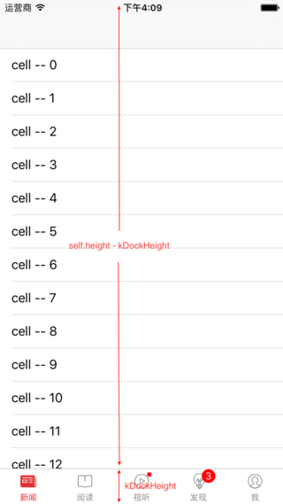

作为系列第一篇文章，就先从最简单的底部的这个Dock栏开始。

## 示例展示

其实说是最简单的，也是应用最广泛的。我们应该看过很多APP的导航界面的样式。基本上就以下两种：

* 系统原生的UITabBar始终在页面底部，并不跟随界面跳转而隐藏和显示
  
* 网易新闻类似的底部TabBar只在每个栏目的首页显示，在第二级或第三级页面隐藏（ps:请自动忽略新闻内容）
  

## 自定义底部Item

既然是自定义控件，就要尽量做到低耦合，高内聚。也就是说外部不用知道内部的具体实现原理，只用公开出一个接口供使用方调用即可。
在这里，外部告诉我要添加一个新的item，同时告诉我这个item的普通图片、选中图片以及显示文字。Dock内部会根据当前添加的item数量规范的调整显示每一个item的位置及状态。
在Dock.h文件中我有一个这个方法:
`- (void)addItemWithIcon:(NSString *)icon selectedIcon:(NSString *)selectedIcon title:(NSString *)title;`
内部实现为：

```objc
- (void)addItemWithIcon:(NSString *)icon selectedIcon:(NSString *)selectedIcon title:(NSString *)title {
    DockItem *dockItem = [[DockItem alloc]init];

    [dockItem setImage:[UIImage imageNamed:icon] forState:UIControlStateNormal];
    [dockItem setImage:[UIImage imageNamed:selectedIcon] forState:UIControlStateSelected];
    [dockItem setTitle:title forState:UIControlStateNormal];
    // 这里你也可以把正常状态和选中状态下的字体颜色开放出去在外部设置
    [dockItem setTitleColor:[UIColor colorWithRed:137/255.0f green:137/255.0f blue:137/255.0f alpha:1] forState:UIControlStateNormal];
    [dockItem setTitleColor:[UIColor colorWithRed:223/255.0f green:41/255.0f blue:43/255.0f alpha:1] forState:UIControlStateSelected];
    [dockItem addTarget:self action:@selector(itemClick:) forControlEvents:UIControlEventTouchDown];
    [self addSubview:dockItem];

    int count = (int)self.subviews.count;
    // Dock默认显示第一项
    if (count == 1) {
        [self itemClick:dockItem];
    }
    CGFloat width = self.frame.size.width / count;
    CGFloat height = self.frame.size.height;
    for (int i = 0; i < count; i++) {
        DockItem *item = self.subviews[i];
        item.tag = i;
        item.frame = CGRectMake(width * i, 0, width, height)
   }
}
```

在每一次添加新的item的同时，其内部自动的重新去设置每个item的位置以达到友好的显示。
其次，我们知道每一个item实是上是一个UIButton，所以要做到这个Button的显示跟系统的不一样，我重写了UIButton的两个方法以达到图片与文字上下显示的效果，给定一个图片与文字的高度的比例，我这里设置的kImageRatio = 0.7，代码如下：

```objc
#pragma mark 调整内部ImageView的frame
- (CGRect)imageRectForContentRect:(CGRect)contentRect
{
    CGFloat imageX = 0;
    CGFloat imageY = 0;
    CGFloat imageWidth = self.frame.size.width;
    CGFloat imageHeight = self.frame.size.height * kImageRatio;
    return CGRectMake(imageX, imageY, imageWidth, imageHeight);
}

#pragma mark 调整内部UILable的frame
- (CGRect)titleRectForContentRect:(CGRect)contentRect
{
    CGFloat titleWidth = self.frame.size.width;
    CGFloat titleHeight = self.frame.size.height * (1 - kImageRatio);
    CGFloat titleX = 0;
    CGFloat titleY = self.imageView.frame.size.height - 3;
    return CGRectMake(titleX, titleY, titleWidth, titleHeight);
}
```

至此，比如说我现在要给Dock栏添加一个新闻item，并把这个item需要的两张图片传进去，那么我只需要执行
`[self.dock addItemWithIcon:@"tabbar_icon_news_normal" selectedIcon:@"tabbar_icon_news_highlight" title:@"新闻"];`就可以了。

## 监听Item点击

接着我们就来介绍如何做到让底部的这个Dock栏随着控制器的切换而做到自动的跟随每一个需要它跟随的控制器。
在日常的开发中，相信大家基本上每个人都做过顶部标题下部菜单类似的APP。并且我相信更多的是第二种的显示方式，细心的人会发现这个Dock栏始终都会跟随每个栏目的第一个控制器，那么我们是不是可以这样考虑，假设说每一个栏目都是一个导航控制器，那么这个导航控制器下可能会push出N多个子控制器，但是这个导航控制器有且只会有一个根(root)控制器，也就是说我们的Dock栏只需要跟随这个导航控制器的根控制器即可。SO...在这里边其实要处理的无非就是底部Dock这个View。

那么先说一下我的思路：

* 整个APP一般可能会有3-5个一级的界面，那么先搞一个MainController来管理这么多子页面
* 一般情况下每个一级的界面都会有2-3个子页面，可见每个子页面都是有一个导航控制器包着的页面
* 我们要实现的功能就是在每个导航控制器的根控制器显示在最前的时候，显示底部Dock栏，那么如果当前显示在最前的控制器不是导航控制器的根控制器时，就要隐藏Dock栏
* 这样就很容易想到UINavigationController的代理方法，我们让MainController成为它的每一个子页面的导航控制器的代理，然后统一在代理方法里去做处理

我先在MainController里添加了五个子控制器

```objc
#pragma mark - Private Methods
- (void)addChildViewControllers {
    UINavigationController *nav = [[UINavigationController alloc] initWithRootViewController:FirstViewController.new];
    nav.delegate = self;
    [self addChildViewController:nav];

    UIViewController *vc = [[UIViewController alloc] init];
    nav = [[UINavigationController alloc] initWithRootViewController:vc];
    vc.view.backgroundColor = [UIColor redColor];
    nav.delegate = self;
    [self addChildViewController:nav];

    vc = [[UIViewController alloc] init];
    nav = [[UINavigationController alloc] initWithRootViewController:vc];
    vc.view.backgroundColor = [UIColor orangeColor];
    nav.delegate = self;
    [self addChildViewController:nav];

    vc = [[UIViewController alloc] init];
    nav = [[UINavigationController alloc] initWithRootViewController:vc];
    vc.view.backgroundColor = [UIColor blueColor];
    nav.delegate = self;
    [self addChildViewController:nav];

    vc = [[UIViewController alloc] init];
    nav = [[UINavigationController alloc] initWithRootViewController:vc];
    vc.view.backgroundColor = [UIColor grayColor];
    nav.delegate = self;
    [self addChildViewController:nav];
}
```

## 处理点击，更新显示

既然是MainController来管理所有的子栏目，那么很显然Dock应该属于MainController的View的子view。也就是说实事上在MainController上显示的每一个子导航控制器的frame的size的height并不是填充了整个屏幕。

那么既然Dock栏并不属于某一个子栏目，我们要怎样使它随着任何一个导航控制器的根控制器来回移动呢，一个处理方法就是：当我们在UINavigationController的代理方法中来做处理。因为当前主控制器(Maincontroller)是所有子栏目导航控制器的代理，这样无论哪一个栏目中的控制器被点击，MainController都能及时的做出处理。
既然我们已经知道当前页面中的逻辑关系，那么接下来要做的就是监听每一次将要push或pop新控制器时，判断当前控制器是不是根控制器。
假如现在要展示一个新的控制器，如果它不是根控制器那么就要拉长当前导航控制器的height，并且此时将Dock从main上边移除，将其添加到root控制器上，这样在某一个导航控制器push出一个新的子页面时，Dock就会跟随root控制器一起被隐藏；同样如果它是根控制器那么就要把拉长的导航控制器的height变回初始高度，并且把Dock从根控制器上重新移回到main上。这里要注意的一点就是，一个操作是在新控制器将要展示之前就要做，另一个是在新控制器展示出来之后再做。至于哪一个是will哪一个是did，大家可以自己考虑一下，如果你真的不太理解可以去看一下这个项目demo的源码(地址在下面会给出)。

Dock栏的移动与隐藏基本上就这样，那么Dock栏既然充当的是一个UITabBar的作用，也就是说我们在选择某一个栏目的同时MainController应该及时的隐藏旧的栏目并显示新的栏目，然而这并不难办，使用代理很简单的就能实现这个功能，在Dock上的item接收到点击事件时改变自身显示的同时告诉自己的代理你现在要给我显示第几个子控制器就行了。至于代码我就不再在这贴了。
最后，我又给这个Dock添加了一个新的小功能，大家在上图应该也能看到第三个和第四个item右上角的一个mark小红点。提示用户某一个栏目中可能有新消息或是活动，添加新消息提示的mark点共有两种模式，一种是只显示有新消息标示而不显示具体数目，另一种是直接显示新消息的条数，那么具体使用哪种模式就看个人爱好了。

---
> 注：此文章首发在[简书](http://www.jianshu.com)转载请说明出处。
> 如果你想看到完整的代码，可以去[这里](https://github.com/Agenric/AGBottomDock)。
