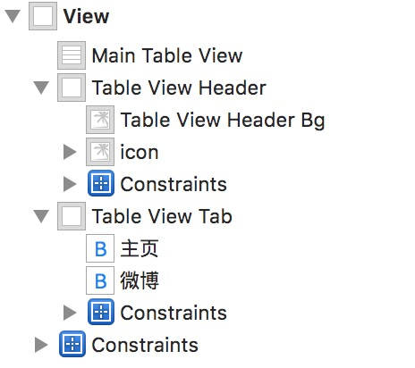

这两天又看了一个新浪微博个人中心界面的一个小功能。

事实上在这大约一年之前，我已经做过类似的Demo。那个时候我应该还在为自己的毕业设计而忙活，当时做这个效果的时候我用了一个可能所有的初学者都会想到的一个方法，那就是给tableView分组。
首先把上边头像后边高度为200px的背景作为一组，然后把下边的选项卡与微博作为另外一组。这样的结果就是，我要去判断当前是第0组还是第一组，以此来返回对应的section的header。

但是这次我运用的方法就显得不那么... 毕竟每个人都要不断学习，不断提高自己。期初这个方法也是我在看[啊崢](http://www.jianshu.com/users/b09c3959ab3b/latest_articles)的文章中看到的。但是我一直认为，不管是自己研究出来的，还是从别的地方看来的，能够消化吸收变成自己的才是真理。

我们先来看一下实现以后的效果：

其实，实现的思想也就以下两点：

1. 导航栏，导航栏的透明度其实是随着scrollView向上的滚动而变的，所以说他们肯定是存在一定的联系。
2. 选项卡，底部所有微博列表上方的选项卡随着tableView的向上的滚动最终会卡在导航栏下方不动，类似于tableView中section的header。但事实上在这里我们根本不用这样做，我们只需要让这个选项卡的顶部始终黏贴在他上方的头像背景图的底部，而后设置头像背景图的最小高度不小于64(即导航栏的高度)即可。

## 搭建界面


从层次划分上看出来类似tableView的header以及tab在self.view上的添加顺序是在mainTableView之后的，这样就能在我们调整tableView的contentInset时候，让他们盖在tableView上方。需要注意的是用户头像是在header这个view中的这样才能保证tableView在上下滚动的时候头像始终都保持在header的中心位置。

## 设置初始界面

在viewDidLoad中，我们要修改当前页面的初始状态，包括tableView的偏移位置，顶部导航栏的透明状态，以及导航栏标题。

```objective-c
#pragma mark - setupUI
- (void)setupUI {
    // tableView
    _defaultOffsetY = -(kTableViewHeaderDefH + kTableViewTabH);
    [self.mainTableView setContentInset:UIEdgeInsetsMake(-_defaultOffsetY, 0, 0, 0)];
    self.automaticallyAdjustsScrollViewInsets = NO;
    [self.mainTableView setTableFooterView:[[UIView alloc] init]];

    // navigationBar
    [self.navigationController.navigationBar setBackgroundImage:[[UIImage alloc] init] forBarMetrics:UIBarMetricsDefault];
    [self.navigationController.navigationBar setShadowImage:[[UIImage alloc] init]];

    // title
    UILabel *titleLabel = [[UILabel alloc] init];
    titleLabel.text = @"Agenric";
    [titleLabel sizeToFit];
    self.navigationItem.titleView = titleLabel;
    _titleLabel = titleLabel;
    _titleLabel.alpha = 0;
    _titleLabel.hidden = YES;
}
```

## 监听tableView的滚动

* 我们事先给header的view一个NSLayoutConstraint类型的属性，同时我们需要定义关于header的两个宏

```objective-c
#define kTableViewHeaderDefH 200
#define kTableViewHeaderMinH 64
```

```objective-c
@property (weak, nonatomic) IBOutlet NSLayoutConstraint *tableViewHeaderH;
```

* header的高度要同时满足以下两个条件。根据用户滚动的偏移量来计算tableViewHeaderH.constant的值，我们知道tableView的contentOffset.y初始值是与header和tab的高度和，也就是说他们之间需要满足这样的关系

```objective-c
tableViewHeaderH.constant = kTableViewHeaderDefH - (tableView. contentOffset.y - (header.height + tab.height))
tableViewHeaderH.constant >= kTableViewHeaderMinH
```

需要注意的是为什么我们要设置一个kTableViewHeaderMinH呢，因为在滚动tableView的时候，我们要保证在其向上滚动时，选项卡最后是要停留在导航栏下边类似tableView的section的header的状态，但其实，事实上我们只是做了一个假的section的header，它的顶部是粘在头像背后的那个高度为200px的header底部的，也就是说如果这个header的高度如果变为0的话选项卡就会被导航栏完全掩盖掉，这显然不是我们要的结果，这也是为什么上一步中我说header要满足的条件的第二条的原因。

最后还要处理的就是导航栏的标题Label，在viewDidLoad中我们把导航栏中的标题Label的透明度设为了0，以及hidden属性设置成了YES。这样我们在计算当前导航栏的透明度时一旦透明度大于0时，就要开始显示这个Label，并且实时修改其透明度，反之就要继续隐藏这个Label。

至此，这个小功能就被我们实现了。
