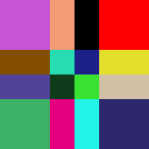
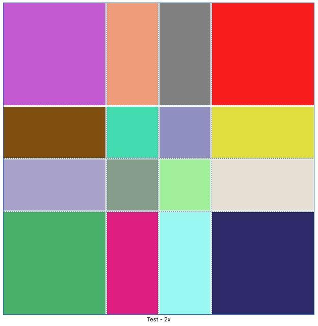
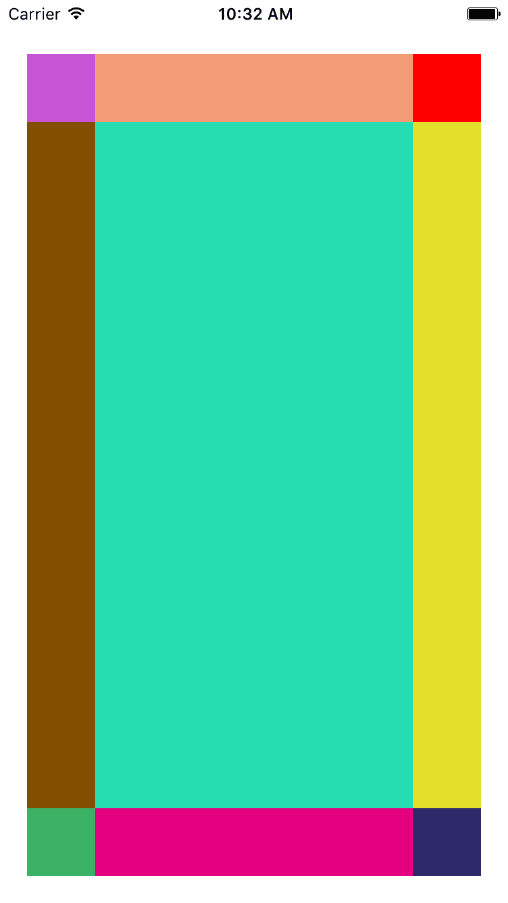

我使用ps自己画了一张图片如下图：

这是一张2倍像素的图片，我把它拖入Assets.xcassets中。选择右下角Slices的类型为`Horizontal and Vertical`：

左侧ShowSlicing显示如下：

在storyboard拖入一个ImageView，上下左右距离边框均为20。则显示如下：

 简单来记就是纵横各三条线，线之外的四个角不会拉伸。六条线内部交汇处，亮色区域为拉伸区域，灰色蒙版区域被截取掉，不显示。仅此而已。
