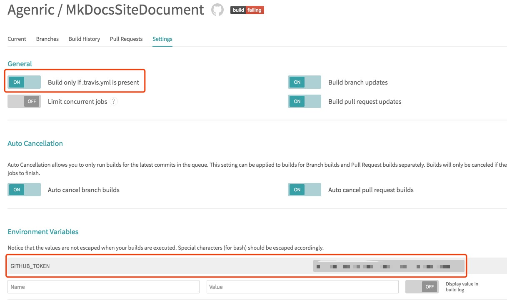

### MkDocs

#### MkDocs是什么

[MkDocs](http://www.mkdocs.org/)是一个轻量级的静态站点生成器，源码使用Markdown来撰写，可以说是相当的适合程序员使用了。

#### MkDocs快速搭建

在本地快速的搭建起一个MkDocs服务：MkDocs依赖 [Python](https://www.python.org/) 和 Python package manager [pip](http://pip.readthedocs.org/en/latest/installing.html) 。

```bash
// 先确保本地的Python和pip正常
$ python --version
Python 2.7.10
$ pip --version
pip 9.0.1 from /Library/Python/2.7/site-packages/pip-9.0.1-py2.7.egg (python 2.7)

$ pip install mkdocs
// 检测是否正确安装
$ mkdocs --help
Usage: mkdocs [OPTIONS] COMMAND [ARGS]...

  MkDocs - Project documentation with Markdown.

Options:
  -V, --version  Show the version and exit.
  -q, --quiet    Silence warnings
  -v, --verbose  Enable verbose output
  -h, --help     Show this message and exit.

Commands:
  build      Build the MkDocs documentation
  gh-deploy  Deploy your documentation to GitHub Pages
  new        Create a new MkDocs project
  serve      Run the builtin development server

// 创建一个项目
$ mkdocs new MkDocsDocument
INFO    -  Creating project directory: MkDocsDocument
INFO    -  Writing config file: MkDocsDocument/mkdocs.yml
INFO    -  Writing initial docs: MkDocsDocument/docs/index.md
$ cd MkDocsDocument
// 查看生成的文件
$ tree
.
├── docs
│   └── index.md
└── mkdocs.yml

1 directory, 2 files
```

OK，现在我假设你已经根据MkDocs的官方文档在本地搭建起来了一个本地服务，以上`MkDocsDocument/docs/index.md` 事实上就是你的主页，这时我们生成一下网站：

```bash
$ mkdocs build
INFO    -  Cleaning site directory
INFO    -  Building documentation to directory: /Users/UserName/MkDocsDocument/site
```

接下来我们要把生成的静态文件push到远程：

```bash
$ cd site
$ git init
$ git remote add origin xxxxx
... balabala
```

具体的git操作不再赘述。

OK，事实上我们这次主题并不是介绍MkDocs。

### MkDocs自动构建

#### 起因

本来我们一直用的hexo也是一个静态站点生成器，不过hexo比较成熟，在使用过程中我们可能并没有感到有什么不适应。然而mkdocs还处在成长阶段。每次写完文档之后，首先需要build，之后进入site文件夹，将该文件夹内生成的静态文件push到远程。如果频繁的更改文档之后就会很繁琐，所以很显然，借助CI来帮助我们。

所以我这次使用mkdocs作为实验品，来讲一下如何借助GitHub和Travis-CI帮我们实现自动构建。先假设我GitHub有一个仓库名`MkDocsDocument`来存放我的原始文档，有一个`MkDocsSite`来存放build之后生成的静态网站文件。GitHub和Travis-CI是一对好基友。所以我们的仓库在GitHub上就可以轻松的借助Travis-CI在我们每次push完代码之后帮我们部署。

#### Travis-CI

1. 去[Travis-CI](https://travis-ci.org/)官网注册一个账号，可以直接用GitHub身份登录。

2. 初次登录之后，会跳转到一个拥有你GitHub所有仓库的一个列表，每一个项目前边都会有一个switch开关，你需要选择你想要同步的那个仓库，即你需要触发自动构建的那个仓库。

   

3. 回到GitHub，注册token，因为我们需要CI可以访问到我们的项目，并且把build之后的静态HTML推送到GitHub。步骤：[GitHub](https://github.com) -> Profile -> [Setting](https://github.com/settings/profile) -> [Developer settings](https://github.com/settings/developers) -> [Personal access tokens](https://github.com/settings/tokens) -> Generate new token。记得生成之后复制这个token保存起来，因为之后你就看不到了，像这样：

   

4. 之后回到Travis-CI，设置这个仓库，对我来说就是设置`MkDocsDocument`，添加刚才我们生成的那个token，具体做什么用，可以看下边的yml文档。

   

5. 编写Travis-CI的配置文件`.travis.yml`，比如我的配置文件如下：

   ```yaml
   language: python
   python:
     - "2.7"

   install:
     - pip install mkdocs

   script:
     - mkdocs build

   after_script:
     - cp CNAME site/CNAME
     - cd site
     - git init
     - git config user.name "Travis-CI"
     - git config user.email "agenricwon@gmail.com"
     - git add .
     - git commit -m "Update docs"
     - git push "https://${GITHUB_TOKEN}@${GITHUB_REF}" master:master

   env:
    global:
      - GITHUB_REF: github.com/Agenric/MkDocsSite.git
   ```

6. 我们看到after_script下第一行有一个cp操作，这是因为我为这个网站配置了一个自定义的二级域名，所以需要在网站的根目录下添加CNAME文件，不再多说。

现在我可以在本地的`MkDocsDocument/docs`文件夹中添加、更新、删除文件，之后`git add、commit、push`。喝一口咖啡，等着CI帮你自动build完成即可。

Done，至此，所有的步骤都完成了。